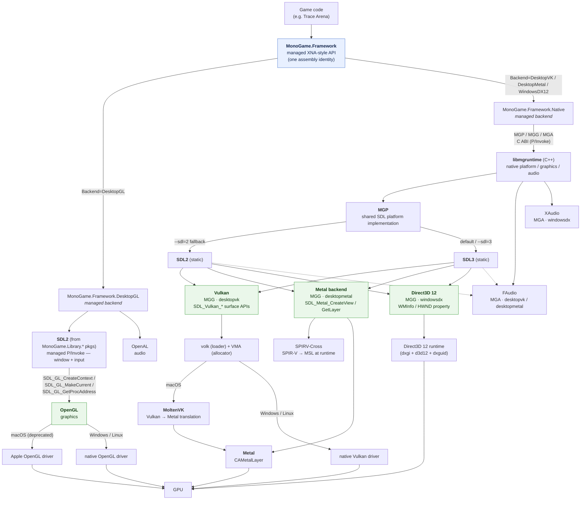

# MonoGame backend & platform dependencies

> Local architecture notes for this fork (`zigrok/MonoGame`) — how MonoGame's public API maps onto
> SDL, the graphics APIs (OpenGL / Vulkan / Metal / Direct3D 12), and, for Vulkan on macOS, MoltenVK.
> Written to explain the codebase; not an upstream contribution.

MonoGame exposes **one managed API** (`MonoGame.Framework`, the XNA-style surface) through two
interchangeable managed implementations: DesktopGL and Native. The Native implementation is paired
with one of three `libmgruntime` graphics modules. All variants produce the *same* managed assembly
name, so game code and libraries (Myra, FontStashSharp, ...) bind to them without change:

| Backend | Assembly / lib | Windowing + input | Graphics | Audio |
|---|---|---|---|---|
| **DesktopGL** (mature managed backend) | `MonoGame.Framework.DesktopGL` | **SDL2** (managed P/Invoke) | **OpenGL** | **OpenAL** |
| **Native — desktopvk** | `MonoGame.Framework.Native` + `libmgruntime` | **SDL2 or SDL3** (static, MGP) | **Vulkan** (MGG); MoltenVK on macOS | **FAudio** (MGA) |
| **Native — desktopmetal** (macOS) | `MonoGame.Framework.Native` + `libmgruntime` | **SDL2 or SDL3** (static, MGP) | **Metal** (MGG), direct `CAMetalLayer`; runtime SPIR-V→MSL | **FAudio** (MGA) |
| **Native — windowsdx** (Windows/Xbox) | `MonoGame.Framework.Native` + `libmgruntime` | **SDL2 or SDL3** (static, MGP) | **Direct3D 12** (MGG) | **XAudio** (MGA) |

Trace Arena exposes these as `Backend=DesktopGL`, `DesktopVK`, `DesktopMetal`, and `WindowsDX12`.
Its default is DesktopMetal on macOS and DesktopGL elsewhere. Native builds can carry both SDL
runtime variants; Trace selects one at launch, with DesktopMetal and WindowsDX12 preferring SDL3.

The native `libmgruntime` is modular: **MGP** = platform (windowing/input, `sdl/MGP_sdl.cpp`),
**MGG** = graphics (`vulkan/MGG_Vulkan.cpp`, `metal/MGG_Metal.mm`, or
`directx12/MGG_DX12.cpp`), and **MGA** = audio (`faudio/MGA_faudio.cpp` or
`xaudio/MGA_xaudio2.cpp`). Vulkan entry points are loaded with **volk** and device memory is managed
with **VMA**. Metal translates the existing Vulkan-profile SPIR-V effects to MSL at runtime with
**SPIRV-Cross** and renders directly to a `CAMetalLayer`, without MoltenVK.

## Dependency graph

## Notes on specific edges

- **SDL is not a peer of the graphics API — the graphics API depends on the selected SDL platform
  layer.** SDL2 or SDL3 owns the window (and, on the native backend, the platform/input loop) and
  *hands it to* the graphics layer, which then calls SDL functions on that window directly:
  - **OpenGL** (DesktopGL): SDL2 creates the GL context and resolves function pointers —
    `SDL_GL_CreateContext`, `SDL_GL_MakeCurrent`, `SDL_GL_GetProcAddress` (`Platform/SDL/SDL2.cs`).
  - **Vulkan** (native, `MGG_Vulkan.cpp`): takes the `SDL_Window*` MGP created and calls
    the SDL2/SDL3 Vulkan extension and surface APIs to build the `VkSurfaceKHR` from that window.
  - **Metal** (native, `MGG_Metal.mm`): takes the same `SDL_Window*`, creates an SDL Metal view, and
    obtains its `CAMetalLayer` through `SDL_Metal_CreateView` and `SDL_Metal_GetLayer`.
  - **Direct3D 12** (native, `MGG_DX12.cpp`): takes the same `SDL_Window*` and calls
    `SDL_GetWindowWMInfo` under SDL2 or reads SDL3's `SDL_PROP_WINDOW_WIN32_HWND_POINTER` property.

  So there is no graphics API in this codebase that talks to the OS/GPU without first going through
  SDL for the window/surface — it is a dependency chain (SDL platform layer → graphics API), not
  independent siblings hanging off the same parent.
- **The managed `MonoGame.Framework.Native` assembly never calls SDL directly** — this is the crucial
  difference from DesktopGL. It only crosses the **MGP / MGG / MGA** C ABI (P/Invoke) into
  `libmgruntime` (e.g. `MGP.Window_Create`, `MGP.Window_GetDrawableSize`). SDL2/SDL3 is used *inside*
  `libmgruntime`, in the shared MGP implementation (`native/monogame/sdl/MGP_sdl.cpp`, guarded by
  `MG_SDL2` / `MG_SDL3`). The platform layer is abstract and the SDL major is a native-library build
  variant. DesktopGL is the opposite: its **managed** code P/Invokes SDL2 directly
  (`Platform/SDL/*.cs`, `Sdl.*`), with no `libmgruntime` in between.
- **SDL2 vs SDL3** — DesktopGL remains SDL2-only. Native premake defaults to SDL3; `--sdl=2` selects
  the fallback. SDL3 uses canonical artifact paths while SDL2 emits a separate `*-sdl2` runtime, and
  both variants share the same guarded MGP sources. Trace copies both available libraries and chooses
  at launch: DesktopMetal and WindowsDX12 default to SDL3, while DesktopVK currently defaults to SDL2.
  The managed `MonoGame.Framework.Native` assembly is identical for both.
- **Native Metal (macOS)** — `desktopmetal` obtains a `CAMetalLayer` from SDL and talks to Metal
  directly. It reuses the Vulkan-profile effect blobs but translates their SPIR-V to MSL at shader
  creation through statically linked SPIRV-Cross. MoltenVK is not present in this path.
- **SDL → MoltenVK (macOS DesktopVK only)** — the selected SDL major owns the Cocoa window and hands
  Vulkan a Metal-compatible surface. MoltenVK creates the Vulkan swapchain over that surface.
- **OpenGL on macOS** — Apple's OpenGL implementation is deprecated. It remains a distinct driver/API
  path; this document does not assume it is implemented as a Metal translation layer.
- **Vulkan on macOS = MoltenVK** — there is no native Vulkan driver on Apple platforms; MoltenVK
  translates Vulkan → Metal. On Windows/Linux, Vulkan calls go straight to the vendor's native
  Vulkan driver. In this fork's DesktopVK build MoltenVK is **statically linked**
  (`-lMoltenVK`, `native/monogame/premake5.lua`); it can alternatively be reached through the Vulkan
  **loader** as an ICD (used for validation layers — see the `desktopvk-vulkan-validation` note).
- **Direct3D 12 / XAudio** — the `windowsdx` native variant; Windows + Xbox only, with SDL2 and SDL3
  platform variants just like the other native backends.
