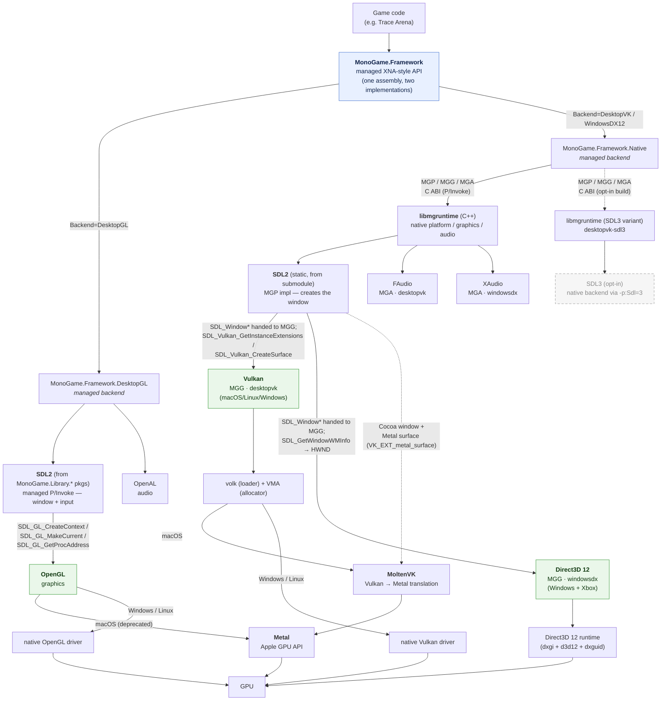

# MonoGame backend & platform dependencies

> Local architecture notes for this fork (`zignd/MonoGame`) — how MonoGame's public API maps onto
> SDL, the graphics APIs (OpenGL / Vulkan / Direct3D 12), and, on macOS, MoltenVK and Metal.
> Written to explain the codebase; not an upstream contribution.

MonoGame exposes **one managed API** (`MonoGame.Framework`, the XNA-style surface) with **two
interchangeable backend implementations**, selected at build time — they produce the *same*
assembly name, so game code and libraries (Myra, FontStashSharp, …) bind to either without change:

| Backend | Assembly / lib | Windowing + input | Graphics | Audio |
|---|---|---|---|---|
| **DesktopGL** (mature, default) | `MonoGame.Framework.DesktopGL` (managed) | **SDL2** (managed P/Invoke) | **OpenGL** | **OpenAL** |
| **Native — desktopvk** | `MonoGame.Framework.Native` + `libmgruntime` (C++) | **SDL2** (static, MGP) | **Vulkan** (MGG) | **FAudio** (MGA) |
| **Native — windowsdx** (Windows/Xbox) | `MonoGame.Framework.Native` + `libmgruntime` (C++) | **SDL2** (static, MGP) | **Direct3D 12** (MGG) | **XAudio** (MGA) |

The native `libmgruntime` is modular: **MGP** = platform (windowing/input, `sdl/MGP_sdl.cpp`),
**MGG** = graphics (`vulkan/MGG_Vulkan.cpp`, `directx12/MGG_DX12.cpp`), **MGA** = audio
(`faudio/MGA_faudio.cpp`). Vulkan entry points are loaded with **volk**; device memory is managed
with **VMA**.

## Dependency graph

## Notes on specific edges

- **SDL2 is not a peer of the graphics API — the graphics API depends on SDL2.** SDL2 owns the window
  (and, on the native backend, the platform/input loop) and *hands it to* the graphics layer, which then
  calls SDL functions on that window directly:
  - **OpenGL** (DesktopGL): SDL2 creates the GL context and resolves function pointers —
    `SDL_GL_CreateContext`, `SDL_GL_MakeCurrent`, `SDL_GL_GetProcAddress` (`Platform/SDL/SDL2.cs`).
  - **Vulkan** (native, `MGG_Vulkan.cpp`): takes the `SDL_Window*` MGP created and calls
    `SDL_Vulkan_GetInstanceExtensions` (which windowing-system extensions the instance needs) and
    `SDL_Vulkan_CreateSurface` (to build the `VkSurfaceKHR` from that window).
  - **Direct3D 12** (native, `MGG_DX12.cpp`): takes the same `SDL_Window*` and calls
    `SDL_GetWindowWMInfo` to pull the native `HWND` out of it.

  So there is no graphics API in this codebase that talks to the OS/GPU without first going through
  SDL2 for the window/surface — it's a dependency chain (SDL2 → graphics API), not independent
  siblings hanging off the same parent.
- **The managed `MonoGame.Framework.Native` assembly never calls SDL directly** — this is the crucial
  difference from DesktopGL. It only crosses the **MGP / MGG / MGA** C ABI (P/Invoke) into
  `libmgruntime` (e.g. `MGP.Window_Create`, `MGP.Window_GetDrawableSize`). SDL2 is used *inside*
  `libmgruntime`, in the MGP implementation (`native/monogame/sdl/MGP_sdl.cpp`, `#include <SDL.h>` /
  `SDL_Init`, guarded by `MG_SDL2`). So grepping the managed Native code for SDL finds only comments
  and error strings, not API calls — the platform layer is abstract, and SDL2 is just one MGP backend
  behind the interop boundary. DesktopGL is the opposite: its **managed** code P/Invokes SDL2 directly
  (`Platform/SDL/*.cs`, `Sdl.*`), with no native lib in between.
- **SDL2 vs SDL3** — SDL2 is the default. DesktopGL's SDL2 comes from the `MonoGame.Library.*` NuGet
  packages (managed bindings); the native backend's is a **static** SDL2 compiled from the
  `native/monogame/external/sdl2` submodule and linked into `libmgruntime`. **SDL3 is now an opt-in
  MGP platform for the native backend** (`external/sdl3` submodule, static, built with the premake
  `--sdl=3` option → a separate `desktopvk-sdl3` libmgruntime; Trace Arena selects it with
  `-p:Backend=DesktopVK -p:Sdl=3`). The MGP sources are shared and `#if MG_SDL3` guarded, so the same
  managed `MonoGame.Framework.Native` assembly drives either. DesktopGL is still SDL2-only. See the
  fork's `SDL3-SUPPORT-PLAN.md`. *(SDL3 is drawn dashed below as not-the-default rather than unused.)*
- **SDL2 → MoltenVK (macOS)** — SDL2 owns the `NSWindow`/Cocoa surface and creates the
  `CAMetalLayer`; the Vulkan swapchain is created on it via `VK_EXT_metal_surface`, which MoltenVK
  requires. So SDL2 is the windowing layer *and* the bridge that hands MoltenVK a drawable.
- **OpenGL on macOS** — Apple's OpenGL is deprecated and is itself implemented on top of Metal at
  the OS level, so DesktopGL on a Mac ultimately reaches the GPU through Metal too (an OS-level
  detail, outside MonoGame's control).
- **Vulkan on macOS = MoltenVK** — there is no native Vulkan driver on Apple platforms; MoltenVK
  translates Vulkan → Metal. On Windows/Linux, Vulkan calls go straight to the vendor's native
  Vulkan driver. In this fork's shipping build MoltenVK is **statically linked**
  (`-lMoltenVK`, `native/monogame/premake5.lua`); it can alternatively be reached through the Vulkan
  **loader** as an ICD (used for validation layers — see the `desktopvk-vulkan-validation` note).
- **Direct3D 12 / XAudio** — the `windowsdx` native variant; Windows + Xbox only.
